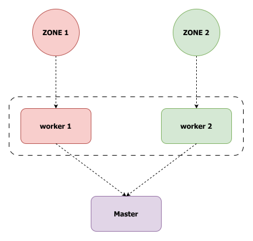

# Better Buses

A fog infrastructure in which GPS sensors are attached to buses, and other trackers are located in bus stops. When a bus arrives at a bus stop, the current time is sent to the workers (at the fog layer), which computes the metrics, such as delay. In addition, the position of the buses is sent too in order to keep track of traffic jams, but these data are not processed. Finally, Prometheus and Grafana are adopted to pull data from the workers and display them onto a dashboard. For scalability purpose, workers and sensors are divided into areas, useful in large metropolitan areas: each sensor is assigned to a zone `Z` and it sends data only to worker `worker-Z`. The targets of the application are public transport agencies.

<div align="center">
  
</div>

## Requirements

- CPU that supports hardware virtualization

- Hardware virtualization enbled in BIOS settings

  - In case of Windows, HyperV disabled is needed

- [Oracle VirtualBox](https://www.virtualbox.org/) (7.2.10 or above)

### Physical machine specs (reference)

These are the main specs of the machine used to host the entire project, written just for reference.

- **CPU** : AMD Ryzen 5 5500 6 cores

- **RAM** : 32 GB DDR4

- **Motherboard** : MSI B550M PRO-VDH

  - **BIOS** :	American Megatrends International, LLC. 2.K0, 11/03/2024

- **OS**: Windows 11 Pro

### OVA specs

- **OS** : Ubuntu server 24.04 LTS

- **CPU** : 4 cores

  - Nested VT-x/AMD-V enabled

  - Nasted paging enabled

- **RAM** : 20 GB

- **Disk** : 80 GB

## Architecture

The repository is structured in branches, each one that is used only from a specific component.

- [Host](https://github.com/Better-Buses/Project/tree/host) : cloned in the host (Ubuntu server), sets up OpenNebula, imports and creates images, VMs templates, security groups and finally the actual VMs. It also forwards ports 30000 and 30001 to Grafana and Prometheus respectively, that run inside the master VM.

- [Master-node](https://github.com/Better-Buses/Project/tree/master-node) : automatically cloned in the Master VM via `start-script.sh` in the context. It sets up [k3s](https://k3s.io/) in server mode, installs [Grafana](https://grafana.com/) configuring the dashboards, [Prometheus](https://prometheus.io/) and nginex, [Falco](https://falco.org/). The bash script `workers-deployments/deploy.sh`, executed after all workers registered in the cluster, creates mosquitto and telegraf deployments that are specifically assigned to workers according to the labels.

- [Worker-node](https://github.com/Better-Buses/Project/tree/worker-node) : automatically cloned in the Workers VMs via `start-script.sh` in the context. It configures k3s in client mode, given the master node token (assigned manually after master node is configured).

- [Sensors](https://github.com/Better-Buses/Project/tree/sensors) : automatically cloned in the Sensors VMs via `start-script.sh` in the context. It provides the scripts to simulate 2 areas, 1 bus and 5 bus stops each. The buses linearly go from a stop to another, and once they arrive to a bus stop, a random delay is generated.

### Pods and namespaces

The following 3 namespaces are defined, with the relative deployments.

- **monitoring** : Grafana and Prometheus stacks

- **zone-Z** : mosquitto and telegraf deployed in `Worker-Z`

- **falco** : Falco

## Usage

Verify the IP of Ubuntu server by accessing with `user: bbus` and `password: foggy`. Then, get the IP the kernel would use to reach the internet (aka the IP of the VM) with the following command.

```sh
ip route get 1.1.1.1 | grep -oP 'src \K\S+'
```

To SSH into the machine with the following command and same password.

```sh
ssh bbus@<UBUNTU_SERVER_IP>
```

To SSH into the OpenNebula VMs, run this command from the ubuntu server machine.

```sh
ssh root@172.16.100.X
```

> [!NOTE]\
> Master VM must have `X=2`, Sensors VM `X=3`, Workers VMs named `Worker-Z` must have `X=(Z+3)` (aka `Worker-1` has `X=4`).

### Services

- **OpenNebula**

  - URL : `<UBUNTU_SERVER_IP>`

  - User : `oneadmin`

  - Password : run this command in ubuntu server to get it.

    ```sh
    sudo -iu oneadmin cat .one/one_auth
    ```

- **Grafana**

  - URL : `<UBUNTU_SERVER_IP>:30000`

  - **ADMIN**

    - User : `admin`

    - Password : `foggy`

  - **Team member**

    - User : `brollo`

    - Password : `trento`

  - **Team admin**

    - User : `grullo`

    - Password : `trento`

- **Prometheus**

  - URL : `<UBUNTU_SERVER_IP>:30001`

  - User : `admin`

  - Password : `promadmin`

### Simulation

To start the simulation, first access Grafana with one of the users and open the `control-panel` dashboard, then SSH into Sensors VM and run this command.

```sh
python3 sensors.py
```

### Falco

To verify Falco's threat detection capabilities, we can simulate three common attack vectors within the cluster. Once triggered, the resulting security alerts will be visible in the `falco` dashboard.
- **Open a remote shell**
```bash
kubectl exec -it <mosquitto-pod> -n zone-<Z> -- sh
```
- **Read sensitive file in container**
```bash
kubectl exec -it <mosquitto-pod> -n zone-<Z> -- cat /etc/passwd
```
- **Unexpected outbound connection**
```bash
kubectl exec -it <mosquitto-pod> -n zone-<Z> -- wget -T 5 http://google.com
```